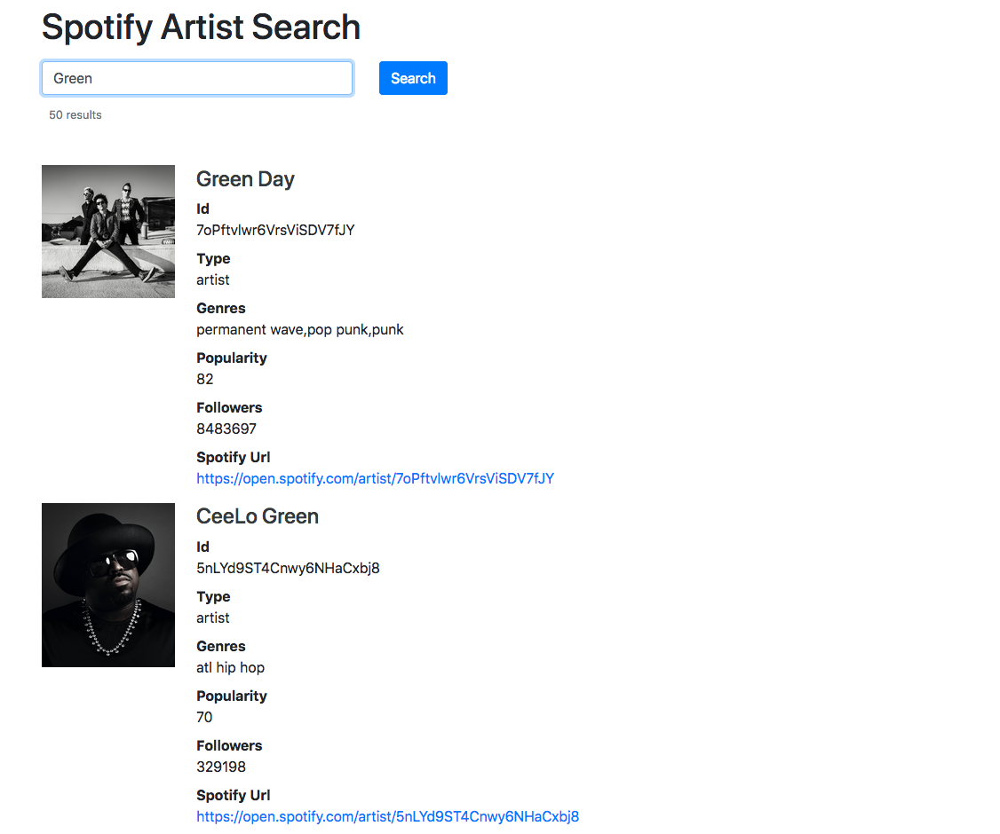

==================================
Spotify API Authorization Examples
==================================

This project contains examples of Spotify API's three authorization flows using Python/Flask:

- Authorization Code
- Client Credentials
- Implicit Grant

The *authorization code* and *implicit grant flow* examples show the
authorizing user's profile, token information, and a button that
refreshes the access token.

The *client credentials flow* example includes a search function that
lists artist information from Spotify.

For details on authorization flows, see `Spotify's Authorization Guide`__

__ https://developer.spotify.com/documentation/general/guides/authorization-guide/

Requirements
------------
- Python 3.6+
- Docker (only if running via docker)

Registration
------------
- `Register`__ your application with ``http://127.0.0.1:5000/callback`` as the redirect URI to obtain an application key and secret.

__ https://developer.spotify.com/documentation/general/guides/app-settings/#register-your-app

Setup
-----
- Clone the repository and step inside. ::

	$ git clone https://github.com/kylepw/spotify-api-auth-examples.git
	$ cd spotify-api-auth-examples

- Set the required environment variables: ::

    $ cp env-template .env
    $ vim .env #Replace `XXX`'s with your values in vim or another editor.
    $ set -a; source .env; set +a

Usage
-----

Docker
~~~~~~

1) Run the following command. Set ``FLOW=`` to ``auth``, ``client``, or ``implicit``: ::

    $ docker --rm --env-file .env -e FLOW=client -p 5000:5000 kylepw/spotify-api-auth-examples:latest

2) Access `http://127.0.0.1:5000` in a browser and click the login button.

From source
~~~~~~~~~~~

1) Create a `virtual environment`__ (not required but **highly** recommended).

2) Install required packages with `pip`__, `pipenv`__, or another package manager. ::

    $ pip install -r requirements.txt #-OR- 'pipenv install' if using pipenv

__ https://docs.python.org/3/tutorial/venv.html#creating-virtual-environments
__ https://pip.pypa.io/en/stable/user_guide/#requirements-files
__ https://pipenv.readthedocs.io/en/latest/

3) Step into one of the three example folders and startup the server. ::

	$ cd authorization_code && flask run
	 * Serving Flask app "app.py" (lazy loading)
 	 * Environment: development
 	 * Debug mode: on
 	 * Running on http://127.0.0.1:5000/ (Press CTRL+C to quit)
	 ...

4) Access the address listed in a browser and click the login button.

License
-------
`MIT License <https://github.com/kylepw/wikiwall/blob/master/LICENSE>`_
